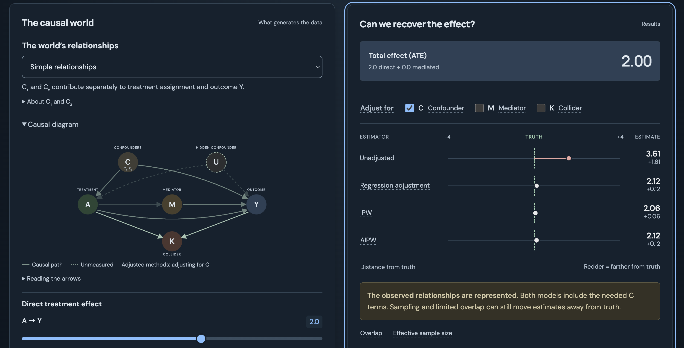

# Causal sandbox

**Change the world. Question the evidence.**

An interactive causal inference playground that runs entirely in your browser. Start with three small experiments: randomized treatment, a common cause, and adjustment with inverse probability weighting. Each introduces one question, a small graph, and estimates beside the known effect.

Open the full sandbox at any time to explore additional variables, model choices, and causal structures. The first chapter uses one actual baseline-health variable; the advanced sandbox uses the two-covariate world described below.

**▶ Live demo: https://kirilklein.github.io/causal-sandbox/**

[](https://kirilklein.github.io/causal-sandbox/)

## First chapter

Predict, try a change, compare the result, and open an explanation when needed. Redraw to explore sample variation. Back, contents, and restart establish the complete lesson baseline, including the sample seed. No completion gate or saved progress.

[Delivery stages and learner walkthrough](docs/education.md) describe the remaining curriculum. Levels 4–11 are not implemented yet; the full sandbox remains a separate advanced experiment.

## In the full sandbox

- **Edit the causal world.** Sliders set every arrow strength in a DAG with treatment A, outcome Y, observed covariates C (C₁, C₂), hidden confounder U, mediator M, and collider K.
- **Play analyst.** Choose which variables the analyst can see, which to adjust for, and whether the outcome and propensity models include the C₁ × C₂ interaction.
- **Compare five estimators against the truth.** Raw association, naive regression, regression adjustment, IPW, and AIPW, each animated against a truth marker.
- **Switch worlds** to add interactions to the outcome, the treatment, or both — and see which estimators break when the model is misspecified.
- **Start from a preset:** Randomized · Observed confounding · Hidden confounding · Collider bias · Mediator adjustment.
- **Look up terms as you explore.** Pause over an underlined term, or tap or click it, for a short definition, or open the collapsed glossary in “How this world works.” Help supports keyboard navigation and Escape to close, without changing the simulation.

The true effect is always known, so every estimate can be judged honestly. No backend, no data collection — it is a static page.

## Run locally

```sh
npm install
npm run dev
```

| Command                | What it does                                       |
| ---------------------- | -------------------------------------------------- |
| `npm run build`        | Static site in `dist/`                             |
| `npm run preview`      | Serve the built site                               |
| `npm test`             | Statistical checks for lessons and sandbox models  |
| `npm run test:browser` | Playwright smoke test against a running dev server |

Pushes to `main` deploy to GitHub Pages.

## The causal world

C₁, C₂ are independent uniform on [-√3, √3]; U and the errors are standard normal.

```
S = 0.8*C1 + 0.6*C2
I = C1*C2
P(A=1) = sigmoid(-0.8 + ca*(S + ta*I) + ua*U)
M = am*A + eM
Y = direct*A + cy*(S + oy*I) + uy*U + my*M + eY
K = 0.9*A + 0.9*Y + eK
ATE = direct + am*my
```

| World                  |  ta |  oy |
| ---------------------- | --: | --: |
| Additive relationships |   0 |   0 |
| Outcome interaction    |   0 | 1.5 |
| Treatment interaction  | 0.7 |   0 |
| Interactions in both   | 0.7 | 1.5 |

## Estimators

All live in `src/simulation.js`, with no statistics dependencies.

| Estimator       | Method                                                   |
| --------------- | -------------------------------------------------------- |
| Raw association | Difference in arm means                                  |
| Naive           | OLS on A alone                                           |
| Regression      | Pooled OLS outcome model, standardized over the sample   |
| IPW             | Logistic propensity, Hájek-normalized weights            |
| AIPW            | Regression outcome model + IPW propensity, doubly robust |

Things to keep in mind when reading the estimates:

- The truth marker is the **total effect**. Adjusting for M or K is a post-treatment mistake, and the app lets you make it.
- Estimates are finite-sample point estimates on one fixed draw — no confidence intervals. The 0.15 "close" threshold is a visual aid, not a test.
- Propensities are clipped to [0.02, 0.98]; the UI shows when clipping bites and the effective sample size.
- Double robustness protects against misspecifying _one_ of the two models. It does nothing about hidden confounding (U) or poor overlap.

## Acknowledgments

The contextual glossary and guided experiments take inspiration from Carlos Mendez’s [Treatment Effects in Stata — Interactive Lab](https://carlos-mendez.org/post/stata_matching/web_app/). The explanations here are original and describe this sandbox’s causal world and estimators.

## License

MIT
