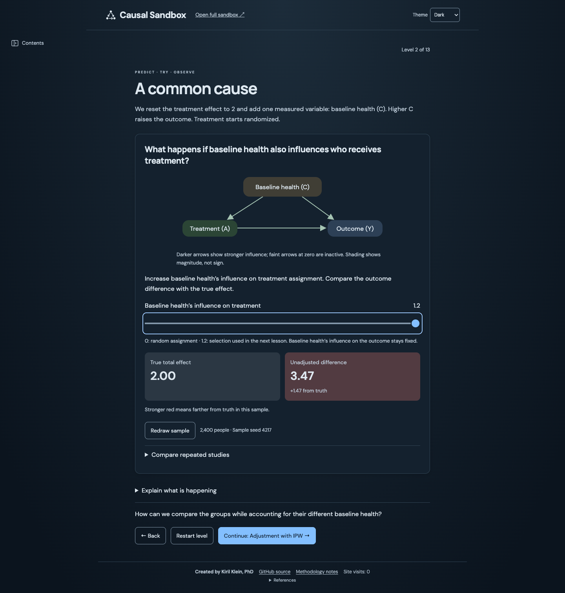

<h1>
  <picture>
    <source media="(prefers-color-scheme: dark)" srcset="docs/brand-mark-dark.svg">
    <source media="(prefers-color-scheme: light)" srcset="docs/brand-mark-light.svg">
    
  </picture>
  Causal Sandbox<br>
  <small>An Interactive Causal Inference Simulator</small>
</h1>

A free, browser-based causal inference simulator and teaching tool. Increase confounding, hide a confounder, condition on a collider, or break positivity, and watch regression adjustment, propensity score IPW, AIPW, and TMLE estimates succeed or fail against the known true effect. Start with guided lessons, then explore the full sandbox. Nothing to install.

## Guided lessons

**[Start the lessons →](https://kirilklein.github.io/causal-sandbox/?lesson=randomization)**

Start with randomization and introduce one concept at a time: confounding, adjustment, causal roles, and model assumptions. Change a setting and compare the estimate with the known effect.

[](https://kirilklein.github.io/causal-sandbox/?lesson=randomization)

## Interactive concept guides

- [Confounding and sample size](https://kirilklein.github.io/causal-sandbox/confounding/)
- [Collider bias](https://kirilklein.github.io/causal-sandbox/collider-bias/)
- [Positivity and overlap](https://kirilklein.github.io/causal-sandbox/positivity/)

Each guide opens a preconfigured experiment, gives specific actions to try, and explains the result against the known true effect.

## Full sandbox

**[Explore the full sandbox →](https://kirilklein.github.io/causal-sandbox/?sandbox)**

Choose a scenario, then customize its world and analysis in separate tabs. Each scenario restores a complete starting setup with two baseline covariates. “Guided lessons” in the header returns to the tutorial.

[](https://kirilklein.github.io/causal-sandbox/?sandbox)

- **Edit the causal world.** Sliders set every arrow strength in a DAG with treatment A, outcome Y, observed covariates C (C₁, C₂), hidden confounder U, mediator M, and collider K.
- **Play analyst.** Choose adjustment variables beside the estimates and configure the outcome and propensity models in the Analysis tab. Graph display controls only fade nodes and arrows; they never change adjustment or estimates.
- **Compare estimates against the truth.** Unadjusted, regression adjustment, IPW, and AIPW use a fixed error scale with starting markers. The unadjusted row combines raw association and the equivalent naive regression.
- **Switch worlds** to add interactions to the outcome, the treatment, or both — and see which estimators break when the model is misspecified.
- **Explore ten scenarios:** randomization, observed or hidden confounding, collider or mediator adjustment, four model-specification comparisons, and an isolated poor-overlap experiment. Restart the selected scenario or share its starting setup through its link.
- **Look up terms as you explore.** Pause over an underlined term, or tap or click it, for a short definition, or open the collapsed glossary in “How this world works.” Help supports keyboard navigation and Escape to close, without changing the simulation.

The true effect is always known, so every estimate can be compared with it. All simulations run in the browser; the static site uses GoatCounter for visit analytics.

[Curriculum and learner walkthrough](docs/education.md).

An interactive [TMLE model-error preview](docs/tmle-robustness.md) compares TMLE
and IPW under shifted and scaled model predictions. It is a standalone experiment
for the planned follow-up lesson, included in the site build.

## Run locally

```sh
npm install
npm run dev
```

| Command                | What it does                                       |
| ---------------------- | -------------------------------------------------- |
| `npm run build`        | Static site in `dist/`                             |
| `npm run preview`      | Serve the built site                               |
| `npm test`             | Statistical checks for lessons and sandbox models  |
| `npm run test:browser` | Playwright smoke test against a running dev server |

Pushes to `main` deploy to GitHub Pages.

### Browser checks

After installing dependencies, start the server in the worktree being tested:

```sh
npm run dev -- --port 5173 --strictPort
```

In another terminal in the same worktree, run `npm run test:browser`. The tests use `http://127.0.0.1:5173/causal-sandbox/` and local Google Chrome. `--strictPort` prevents Vite from silently moving to another port and leaving the tests pointed at a different checkout.

For another port, set `APP_URL` to the full base URL, including `/causal-sandbox/`, when running the tests. To use Playwright's bundled Chromium instead of Chrome, run `npx playwright install chromium`, then `CI=1 npm run test:browser`. CI tests the built site; reproduce that with `npm run build` and `npm run preview -- --port 5173 --strictPort` in place of the dev server.

## The causal world

C₁, C₂ are independent uniform on [-√3, √3]; U and the errors are standard normal.

```
S = 0.8*C1 + 0.6*C2
I = C1*C2
P(A=1) = sigmoid(-0.8 + ca*(S + ta*I) + ua*U)
M = am*A + eM
Y = direct*A + cy*(S + oy*I) + uy*U + my*M + eY
K = 0.9*A + 0.9*Y + eK
ATE = direct + am*my
```

| World                  |  ta |  oy |
| ---------------------- | --: | --: |
| Additive relationships |   0 |   0 |
| Outcome interaction    |   0 | 1.5 |
| Treatment interaction  | 0.7 |   0 |
| Interactions in both   | 0.7 | 1.5 |

## Estimators

All live in `src/simulation.js`, with no statistics dependencies.

| Estimator       | Method                                                   |
| --------------- | -------------------------------------------------------- |
| Raw association | Difference in arm means                                  |
| Naive           | OLS on A alone                                           |
| Regression      | Pooled OLS outcome model, standardized over the sample   |
| IPW             | Logistic propensity, Hájek-normalized weights            |
| AIPW            | Regression outcome model + IPW propensity, doubly robust |

Things to keep in mind when reading the estimates:

- The truth marker is the **total effect**. Adjusting for M or K is a post-treatment mistake, and the app lets you make it.
- Estimates are finite-sample point estimates on one fixed draw — no confidence intervals. The 0.15 "close" threshold is a visual aid, not a test.
- Propensities are clipped to [0.02, 0.98]; the UI shows when clipping bites and the effective sample size.
- Double robustness protects against misspecifying _one_ of the two models. It does nothing about hidden confounding (U) or poor overlap.

## Acknowledgments

The contextual glossary and guided experiments take inspiration from Carlos Mendez’s [Treatment Effects in Stata — Interactive Lab](https://carlos-mendez.org/post/stata_matching/web_app/). The explanations here are original and describe this sandbox’s causal world and estimators.

The treatment of TMLE draws on Katherine Hoffman’s [An Illustrated Guide to TMLE](https://www.khstats.com/blog/tmle/tutorial), especially the [visual guide](https://www.khstats.com/blog/tmle/tutorial-pt2) (also on [GitHub](https://github.com/kathoffman/causal-inference-visual-guides)), an excellent walkthrough of the targeting step.

## Contributing

Ideas, corrections, and contributions are welcome. Open an [issue](https://github.com/kirilklein/causal-sandbox/issues/new/choose) to report a bug, correct an explanation, or propose a lesson, scenario, or estimator. For anything beyond a small fix, open an issue first so we can agree on scope before you write code. See [CONTRIBUTING.md](CONTRIBUTING.md) for setup and what a good PR looks like.

To the theorists: apologies in advance. Here we lead with intuition, starting from simple settings. For a full and rigorous theoretical coverage, see van der Laan and Rose, _Targeted Learning_ (Springer, 2011), and Hernán and Robins, [_Causal Inference: What If_](https://miguelhernan.org/whatifbook).

## License

MIT
