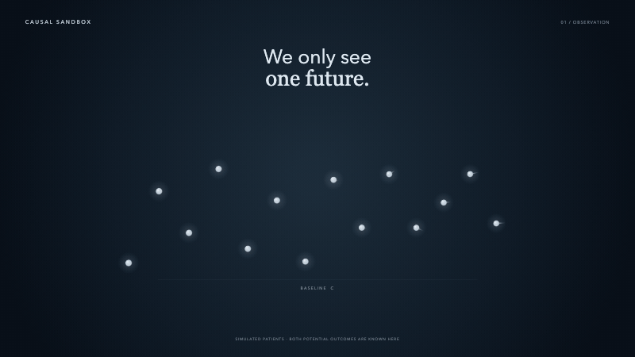
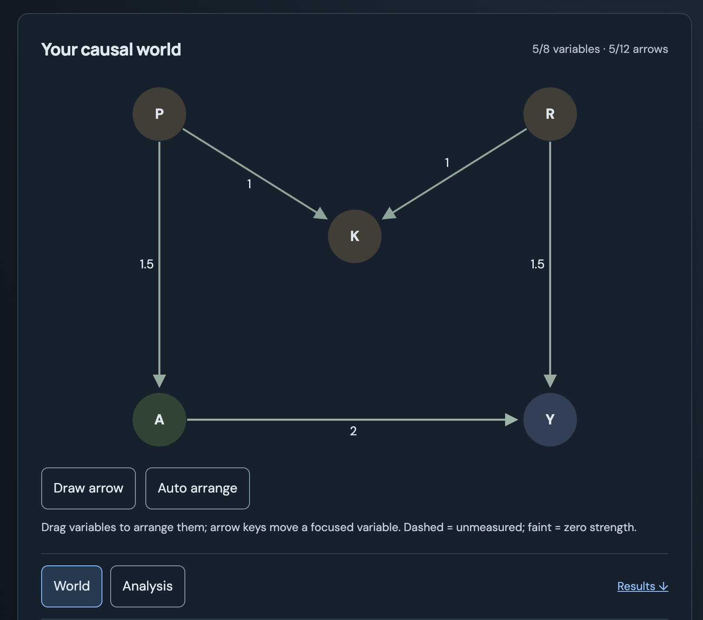

<h1>
  <picture>
    <source media="(prefers-color-scheme: dark)" srcset="docs/brand-mark-dark.svg">
    <source media="(prefers-color-scheme: light)" srcset="docs/brand-mark-light.svg">
    
  </picture>
  Causal Sandbox 
  <small>An Interactive Causal Lab</small>
</h1>

Learn causal inference through experiments. Free, in your browser, with nothing to install.

**[Learn](https://kirilklein.github.io/causal-sandbox/?lesson=learn) · [Explore scenarios](https://kirilklein.github.io/causal-sandbox/?sandbox) · [Build your own graph](https://kirilklein.github.io/causal-sandbox/?sandbox=graph-lab)**

## [Learn →](https://kirilklein.github.io/causal-sandbox/?lesson=learn)

Build intuition through guided experiments, one concept at a time.

Try [TMLE vs IPW: when models are wrong](https://kirilklein.github.io/causal-sandbox/docs/tmle-robustness-preview.html): explore how model errors interact across two heatmaps.

## [Explore scenarios →](https://kirilklein.github.io/causal-sandbox/?sandbox)

Change a simulated world and compare estimates with the known effect.

## [Build your own graph →](https://kirilklein.github.io/causal-sandbox/?sandbox=graph-lab)

Draw causal relationships and explore what your adjustment choices imply.

## How it works

The simulated world gives us a known causal effect. Change the world or the analysis to see when an estimate recovers that effect and when it fails. Lessons cover confounding, adjustment, regression, IPW, AIPW, TMLE, and their assumptions.

All simulations run in your browser. See the [methodology](https://kirilklein.github.io/causal-sandbox/methodology/) for models and limitations, the [curriculum](docs/education.md) for the learning sequence, and the [analytics notes](docs/analytics.md) for visit and interaction tracking.

## Interactive concept guides

- [Confounding and sample size](https://kirilklein.github.io/causal-sandbox/confounding/)
- [Collider bias](https://kirilklein.github.io/causal-sandbox/collider-bias/)
- [Positivity and overlap](https://kirilklein.github.io/causal-sandbox/positivity/)
- [Inverse probability weighting](https://kirilklein.github.io/causal-sandbox/inverse-probability-weighting/)
- [AIPW and double robustness](https://kirilklein.github.io/causal-sandbox/aipw-double-robustness/)
- [Mediator adjustment](https://kirilklein.github.io/causal-sandbox/mediator-adjustment/)
- [Targeted minimum loss-based estimation](https://kirilklein.github.io/causal-sandbox/tmle/)
- [Propensity-score clipping and trimming](https://kirilklein.github.io/causal-sandbox/propensity-score-clipping-trimming/)

Each guide pairs an experiment with actions to try and an explanation of the result.

## Citation

If you use Causal Sandbox in teaching or research, please cite the software:

> Klein, K. (2026). _Causal Sandbox_ (Version 1.0.0) [Computer software]. https://github.com/kirilklein/causal-sandbox

GitHub also provides APA and BibTeX formats from [CITATION.cff](CITATION.cff).

## References

For deeper theoretical coverage:

- Hernán and Robins, [_Causal Inference: What If_](https://miguelhernan.org/whatifbook).
- van der Laan and Rose, _Targeted Learning_ (Springer, 2011).

## Acknowledgments

The contextual glossary and guided experiments take inspiration from Carlos Mendez’s [Treatment Effects in Stata — Interactive Lab](https://carlos-mendez.org/post/stata_matching/web_app/). The explanations here are original and describe this sandbox’s causal world and estimators.

The treatment of TMLE draws on Katherine Hoffman’s [An Illustrated Guide to TMLE](https://www.khstats.com/blog/tmle/tutorial), especially the [visual guide](https://www.khstats.com/blog/tmle/tutorial-pt2) (also on [GitHub](https://github.com/kathoffman/causal-inference-visual-guides)), an excellent walkthrough of the targeting step.

## Contributing

Ideas and corrections are welcome. [Open an issue](https://github.com/kirilklein/causal-sandbox/issues/new/choose) to report a bug or suggest a lesson, scenario, or estimator. For anything beyond a small fix, open an issue first to agree on scope. See [CONTRIBUTING.md](CONTRIBUTING.md) for setup and development.

## License

MIT

